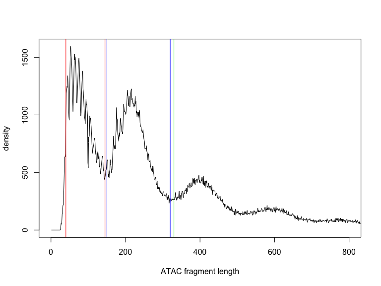
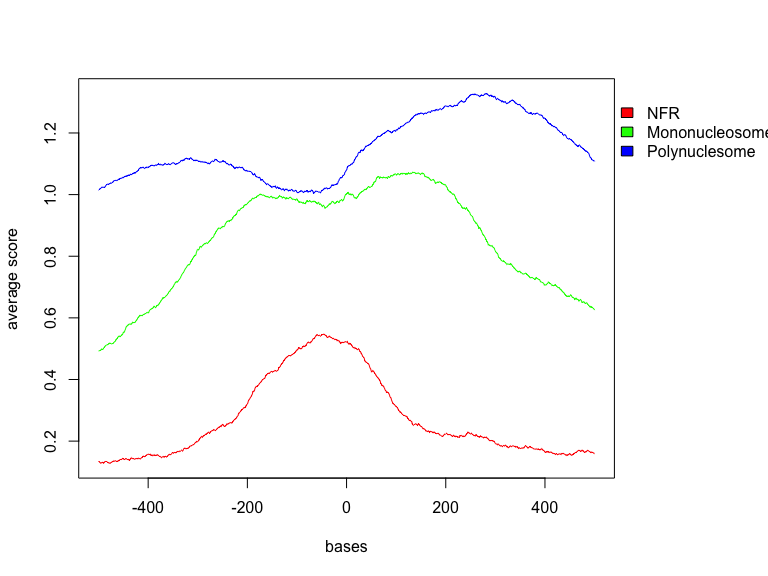
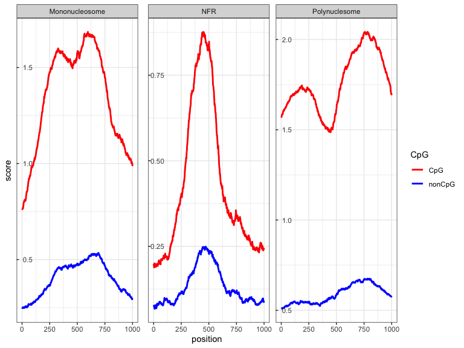

# 1. Raw data mapping workflow
## 1.1. Reads trimming and adapter filtering

As most NGS assays, the first task in processing the raw ATAC-seq data is 
mapping to the reference genome. This step is usually preceded by removing any 
potential remaining sequencing adapters and low quality reads from the input 
`.fastq` files. There are many tools available for the task, some of them being 
`cutadapt` and its wrap-up program `trimgalore`. Here is the example of adapter 
trimming command:


```bash

cutadapt -m 5 -e 0.10 -a CTGTCTCTTATA -A CTGTCTCTTATA -o \ 
${IN_FASTQ_R1$.fastq}.trim.fq -p  ${IN_FASTQ_R2$.fastq}.trim.fq \ 
$IN_FASTQ_R1 $IN_FASTQ_R2
 
```

## 1.2. Mapping to the reference genome

After read filtering and trimming, we are ready to map the reads on 
the reference genome. The mapping program usually requires an indexed genome
along with sequencing reads. Each tool has instructions on how to construct the 
indexed genome. We are using `bowtie2` as an example mapper. The index can be 
built from a genome sequence file in `.fasta` format using the `bowtie2-build` 
command. It is necessary to index the genome only once, and it can be used in 
all the following mapping jobs to that genome. Here is a mock command for 
creating the genome index, mapping the reads to the genome, and creating the
bam index file from a sorted `.bam` file:


```bash

bowtie2-build hg38.fasta hg38_idx
bowtie2   -X2000 --mm --local --threads 2 -x hg38_idx \
			-1 ${IN_FASTQ_R1$.fastq}.trim.fq  -2 ${IN_FASTQ_R1$.fastq}.trim.fq |\ 
			samtools view -Sb - | samtools sort - > out.bam
samtools index out.bam

```

## 1.3. Post-alignment filtering and cleaning steps

Once mapped, we can filter out any unmapped read from the `.bam` file, remove 
improperly paired reads, and remove optical duplicates. Since a significant 
proportion of reads in the ATAC-seq assay comes from mitochondrial DNA, we should 
filter those too, because otherwise our subsequent analysis steps will be skewed.
This step relies on `samtools` flags and the flag fields in the `.bam` file.
The explanation of those can be found in the `samtools` documentation and which 
flags are included for filtering (`-F` option in `samtools view`) or retaining 
(`-f` option in `samtools view`) can be assessed on the following link: https://www.samformat.info/sam-format-flag
With the flag `-F 1804` we are removing the following reads:  
1. Read unmapped (flag 4)  
2. Mate unmapped (flag 8)  
3. Not primary alignment (flag 256)  
4. Read fails platform/vendor quality check (flag 512)  
5. Read is PCR or optical duplicate (flag 1024)  
To fix the mates with `samtools fixmate` reads needs to be sorted by name 
(`sambamba -n` option), and we convert it to sorted by position again.


```bash

samtools view -F 1804 -f 2 -q 30 -u out.bam |\ 
sambamba sort -t 2 -n /dev/stdin -o out.dupmark.bam 
samtools fixmate -r out.dupmark.bam out.fixmate.bam

samtools view -F 1804 -f 2 -u out.fixmate.bam |\ 
sambamba sort -t 2 /dev/stdin -o out.filt.bam

picard MarkDuplicates \
				INPUT="out.filt.bam" \
				OUTPUT="out.dupmark.bam" \
				METRICS_FILE="out.dup.qc" VALIDATION_STRINGENCY=LENIENT \
				ASSUME_SORTED=true REMOVE_DUPLICATES=false; 
				
samtools view -F 1804 -f 2 -b out.dupmark.bam > out.nodup.bam
sambamba index -t 6 out.nodup.bam

# this is just one ugly solution to filter out mitochondrial reads
samtools idxstats out.nodup.bam | cut -f 1 | grep -v MT |\
xargs samtools view -b out.nodup.bam > output.final.bam
sambamba index -t 6 output.final.bam

```

Now we should finally have an indexed `.bam` file which should be a starting 
point in our analysis.

# 2. Reading the `.bam` file into R

We will now start exploring the mapped ATAC-seq reads from the mouse embryonic 
stem-cell sample. The `.bam` file and its index can be downloaded from 
[here](data.genereg.net/damir/CBW_2022/), and read in the R session.


```r
input_bam <- "~/Downloads/mESC_chr1.bam"
# just a test script to see how much memory it uses


library(rtracklayer)
library(GenomicAlignments)
library(GenomicRanges)
library(stringr)
library(BSgenome.Mmusculus.UCSC.mm10)

# import

bam_root <- str_replace(input_bam, "\\.bam", "")
bamFile <- BamFile(file = input_bam, yieldSize = 50000)
open(bamFile)
print("Opened bam file")
```

```
## [1] "Opened bam file"
```

```r
dataIn <- DataFrame()
print("Created an empty GRanges object. Starting conversion...")
```

```
## [1] "Created an empty GRanges object. Starting conversion..."
```

```r
while (length(chunk <- readGAlignmentPairs(bamFile))) {
    dataIn <- rbind(dataIn, as.data.frame(as(object = chunk, Class = "GRanges")))
}

print("Converted! Sorting...")
```

```
## [1] "Converted! Sorting..."
```

```r
fragments <- as(object = dataIn, Class = "GRanges")
seqlevels(fragments) = seqlevels(BSgenome.Mmusculus.UCSC.mm10)
seqinfo(fragments) = seqinfo(BSgenome.Mmusculus.UCSC.mm10)
genome(fragments) = genome(BSgenome.Mmusculus.UCSC.mm10)
head(fragments)
```

```
## GRanges object with 6 ranges and 0 metadata columns:
##       seqnames          ranges strand
##          <Rle>       <IRanges>  <Rle>
##   [1]     chr1 3005848-3006110      -
##   [2]     chr1 3006434-3006965      -
##   [3]     chr1 3007324-3007389      -
##   [4]     chr1 3007470-3007887      -
##   [5]     chr1 3008720-3008771      +
##   [6]     chr1 3008851-3008928      +
##   -------
##   seqinfo: 239 sequences (1 circular) from mm10 genome
```

```r
print("Data succesfuly converted to GRanges. Moving on")
```

```
## [1] "Data succesfuly converted to GRanges. Moving on"
```

# 3. Exploring frangment length distribution

Once we loaded the reads in the R environment now we can plot the fragment length
distribution to identify fragments spanning over a nucleosome or located in the 
nucleosome free region (NFR). After identifying the approximate boundaries,
we can split the fragments in three groups:  
 *  Nuclosome free region fragments  
 *  Mononucleosome fragments  
 *  Polynucleosome fragments  


```r
print("Ploting the insert size histogram...")
```

```
## [1] "Ploting the insert size histogram..."
```

```r
fragments.length.histogram = hist(width(fragments), plot = F, breaks = seq(0.5, 2000.5))

# pdf(paste(bam_root,'.fragment_length_distribution.pdf', sep = ''))

plot(x = fragments.length.histogram$mids, y = fragments.length.histogram$counts,
    xlim = c(0, 800), type = "l", xlab = "ATAC fragment length", ylab = "density")

abline(v = 40, col = "red")
abline(v = 145, col = "red")
abline(v = 150, col = "blue")
abline(v = 320, col = "blue")
abline(v = 330, col = "green")
```

<!-- -->

```r
splitReads <- function(x, minLen, maxLen) {

    x = x[width(x) >= minLen]
    x = x[width(x) <= maxLen]
    return(x)

}

frag.nsomeFree = splitReads(fragments, 40, 145)
frag.monoNsome = splitReads(fragments, 150, 320)
frag.polyNsome = splitReads(fragments, 330, 800)
```

# 4. Exploring signals around annotated TSS

Now when we split the signal into different information categories, we can 
explore the signal around functional units of the genome. Promoters are regions
in the genome where transcription initiation occurs. They are characterised by 
open chromatin around the transcriptional start site (TSS) and well positioned 
nucleosomes -1, and +1. After retrieving the mouse transcript model, we can 
extract promoters and analyse the signal around them. An convenient way to show 
genomic signals is n a form of heatmap, where each row represents one promoter 
and columns represent regions around the TSS. We can also plot an average signal
for all the promoters at a specific position as an aggregate or a meta-plot. 
Finally, it is often convenient to sort the sequence in the heatmap in a 
specific order to reveal the trends in the data. 


```r
library(TxDb.Mmusculus.UCSC.mm10.knownGene)

mm_promoters <- promoters(genes(TxDb.Mmusculus.UCSC.mm10.knownGene), upstream = 500,
    downstream = 500)
mm_promoters_chr1 <- mm_promoters[seqnames(mm_promoters) == "chr1"]

library(genomation)

promoter_atac_SM <- ScoreMatrixList(targets = list(NFR = coverage(frag.nsomeFree),
    Mononucleosome = coverage(frag.monoNsome), Polynuclesome = coverage(frag.polyNsome)),
    windows = mm_promoters_chr1, strand.aware = T, weight.col = "score")

library(RColorBrewer)

pdf("plots/promoter_ATAC_signal.pdf")
multiHeatMatrix(promoter_atac_SM, xcoords = c(-500, 500), winsorize = c(0, 95), col = brewer.pal(7,
    "Blues"))
dev.off()
```

```
## quartz_off_screen 
##                 2
```

```r
pdf("plots/promoter_ATAC_signal_ordered.pdf")
multiHeatMatrix(promoter_atac_SM, xcoords = c(-500, 500), winsorize = c(0, 95), col = brewer.pal(7,
    "Blues"), order = T)
dev.off()
```

```
## quartz_off_screen 
##                 2
```

```r
plotMeta(promoter_atac_SM, profile.names = names(promoter_atac_SM), winsorize = c(0,
    95), xcoords = c(-500, 500))
```

<!-- -->

# 5. Exporting the signal tracks

Finally, we can export the fragments and visualise the signals in IGV.


```r
export.bw(object = coverage(frag.nsomeFree), con = paste(bam_root, ".nsomeFree.bw",
    sep = ""))
export.bw(object = coverage(frag.monoNsome), con = paste(bam_root, ".monoNsome.bw",
    sep = ""))
export.bw(object = coverage(frag.polyNsome), con = paste(bam_root, ".polyNsome.bw",
    sep = ""))
```

# 6. Spearting different group of features

It is often useful to compare the signal between two different groups of features.
In our case, we can explore how open chromatin behave in CpG island promoters 
compared to non-CpG island promoters. The CpG island location can be retrieved 
from the UCSC Genome Browser. Unfortunately, since `genomation` lacks the 
ability to plot meta-plots in different groups, we will have to get creative and 
make our own pipline to do that.


```r
library(magrittr)

mySession = browserSession("UCSC") 
genome(mySession) <- "mm10" 
tbl.cpgi <- getTable(
  ucscTableQuery(mySession, track="CpG Islands",  table="cpgIslandExt")) %>%
  makeGRangesFromDataFrame(keep.extra.columns = T)

cpg_prom <- ifelse(mm_promoters_chr1 %over% tbl.cpgi,
                   "CpG", "nonCpG")

pdf("plots/promoter_ATAC_signal_ordered_cpg.pdf")
multiHeatMatrix(promoter_atac_SM, xcoords = c(-500, 500), 
                winsorize = c(0, 95), 
                col = brewer.pal(7, "Blues"),
                order = T, group = factor(cpg_prom))
dev.off()
```

```
## quartz_off_screen 
##                 2
```

```r
library(tidyverse)

customWinsorize <- function(x, probs = c(0, .99)){
  vals <- quantile(x, probs = probs)
  tmp <- x
  tmp[x < vals[1]] <- vals[1]
  tmp[x > vals[2]] <- vals[2]
  tmp
}

metaplotCpG <- lapply(names(promoter_atac_SM), function(x) {
    promoter_atac_SM[[x]]@.Data %>% customWinsorize(probs = c(0, .95)) %>%
      as.data.frame() %>% mutate(cpg =
                                   cpg_prom) %>%
      group_by(cpg) %>% summarize(across(everything(), mean)) %>%
      ungroup %T>% { colnames(.)[2:ncol(.)] <- 1:(ncol(.) - 1) } %>%
      pivot_longer(-cpg, names_to = "position", values_to = "score") %>%
      mutate(position = as.numeric(position),
             # score = (score - min(score)) / (max(score) - min(score)),
             nucleosome = x)
}) %>% { do.call(rbind, .) }


cpgMetaPlt <- metaplotCpG %>% 
   mutate(cpg = factor(cpg, 
                         levels = c("CpG", "nonCpG")),
          nuclesome = factor(nucleosome, 
                          levels = 
                            c("NFR", "Mononucleosome", "Polynucleosome"))) %>%
    ggplot(aes(position, score, group = cpg, color = cpg)) + 
    geom_line(size = 1) + facet_wrap(vars(nucleosome), 
                                     scales = "free_y", nrow = 1) + 
    theme_bw() + scale_color_manual(values = c("red", "blue"), 
                                    labels = c("CpG",
                                               "nonCpG")) +
    #scale_x_continuous(labels = c(-500, -250, 0, 250, 500)) + 
  labs(color = "CpG") + theme(axis.ticks.length.y = unit(-0.1, "cm"),
                                 axis.text.y = element_text(hjust = 0,
                                                            margin = 
                                                              margin(l = 10,
                                                                     r = -20)))

cpgMetaPlt
```

<!-- -->

