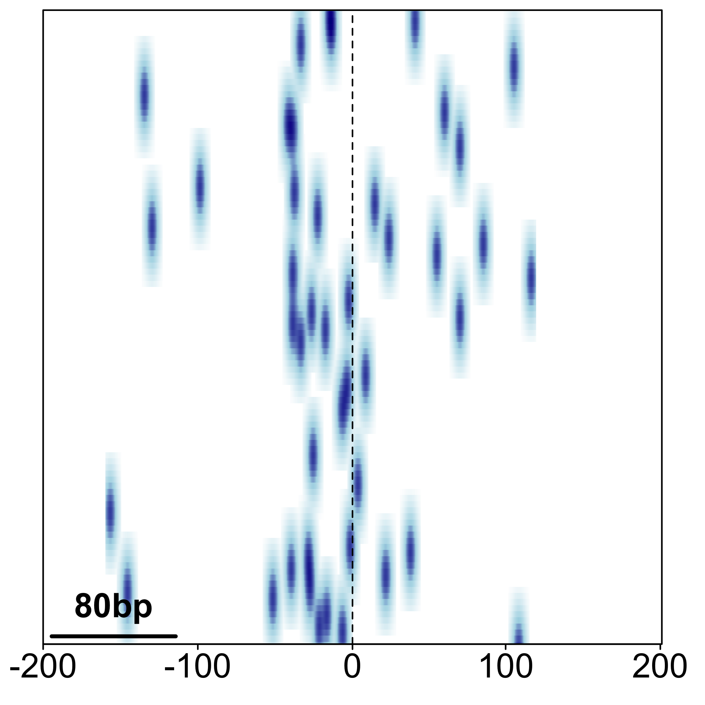

# 1. Peak file import

The second part of our practical will focus on exploring regions of enriched 
signal, also called peaks. Our peaks are stored in the `narrowPeak` format.
We will explore where they are located in the genome,
which genes they are associated with, and finally some basic motif analysis.
Lets first load the peaks and explore the peak file.

```{r, tidy=T, message=F, warning=F}

library(rtracklayer)

peaks <- import("data/SRR3536937_1.trim.PE2SE.nodup.tn5_SRR3536938_1.trim.PE2SE.nodup.tn5.pf.narrowPeak.gz")
head(as.data.frame(peaks))

```

# 2. Peak genomic annotation and distribution

After loading and exploring the peak file, we can now assess where they are 
located in the genome. We will see which genomic features the peaks overlap with 
and how far they are located to the closest promoter.

```{r, tidy=T, message=F, warning=F}

library(ChIPseeker)
library(org.Mm.eg.db)
library(TxDb.Mmusculus.UCSC.mm10.knownGene)

peak_annotation <- annotatePeak(peaks, 
                                TxDb = TxDb.Mmusculus.UCSC.mm10.knownGene,
                                annoDb = "org.Mm.eg.db")

plotAnnoBar(peak_annotation)
vennpie(peak_annotation)
upsetplot(peak_annotation)
upsetplot(peak_annotation, vennpie = T)
plotDistToTSS(peak_annotation)
hist(peak_annotation@anno$distanceToTSS, breaks = 2000, xlim = c(-50000, 50000))


```

# 3. Gene Ontology (GO) Enrichment analysis

Once we annotated the peaks, and associated them with genes, we can look if there
are any particular gene family, processes or pathways enriched in our gene set.

```{r, tidy=T, message=F, warning=F}

library(clusterProfiler)

assignedGenes <- peak_annotation@anno$ENSEMBL
enrich <- enrichGO(assignedGenes,
                   OrgDb = org.Mm.eg.db,
                   keyType = "ENSEMBL",
                   ont = "ALL")

dotplot(enrich)

```

# 4. Motif analysis - getting motif PWMs

Next, we will explore how to find instances of specific known motifs in a set of 
genomic regions. In our case, it will be in the top 1000 scoring peaks we used 
throughout the course. One of the most comprehensive database of manually curated
TFBS matrices is [JASPAR](jaspar.genereg.net). On the JASPAR webpage, we can 
find the entry for a TFBS of interest (in our case CTCF), and retrieve it from
the `JASPAR2020` Bioconductor packge using the `TFBSTools` interface.

```{r, tidy=T, warning=T, message=T}

library(TFBSTools)
library(JASPAR2020)

ctcf_pfm <- getMatrixByID(JASPAR2020, ID = "MA0139.1")
ctcf_pwm <- toPWM(ctcf_pfm)

seqLogo(toICM(ctcf_pfm))
```

# 5. Motif analysis - finding motif instances in peaks

To find motif instances within peaks, we need to first retrieve the sequence of 
the peaks, and then scan the sequence with the motif PWM.

```{r, tidy=T, warning=T, message=T}

library(BSgenome.Mmusculus.UCSC.mm10)

motif_occurence <- searchSeq(ctcf_pwm, 
                             getSeq(BSgenome.Mmusculus.UCSC.mm10, 
                                    peaks[1:1000]),
                             min.score = "90%")

motif_occurence_df <- writeGFF3(motif_occurence)
head(motif_occurence_df)
```

# 6. Motif analysis - getting the peaks with motifs

We can now associate motif instances with their respective peaks.

```{r, tidy=T, warning=T, message=T}

top_peaks_with_motifs <- unique(as.numeric(motif_occurence_df$seqname))
getSeq(BSgenome.Mmusculus.UCSC.mm10,
       peaks[top_peaks_with_motifs[1]])[[1]][347:365]

```

# 7. Motif analysis - analysisng motif position

Finally, we can estimate and visualise motif position within our peaks using
the `seqPattern` Bioconductor package.

```{r, tidy=T, warning=T, message=T}

library(magrittr)

top_peaks_with_motifsGR <- peaks[top_peaks_with_motifs]
peak_centered <- shift(top_peaks_with_motifsGR, top_peaks_with_motifsGR$peak) %>%
  resize(width = 1, fix = "start")
peak_centered_200bpFlank <- peak_centered + 200
peak_centered_200bpFlank_seq <- getSeq(BSgenome.Mmusculus.UCSC.mm10,
                                       peak_centered_200bpFlank)

library(seqPattern)

plotMotifDensityMap(regionsSeq = peak_centered_200bpFlank_seq, 
                    motifPWM = Matrix(ctcf_pwm),  minScore = "90%",
                    flankUp = 200, flankDown = 200)

plotMotifOccurrenceAverage(regionsSeq = peak_centered_200bpFlank_seq, 
                    motifPWM = Matrix(ctcf_pwm),  minScore = "90%",
                    flankUp = 200, flankDown = 200, 
                    color = c("red3"), cex.axis = 0.9)

```

