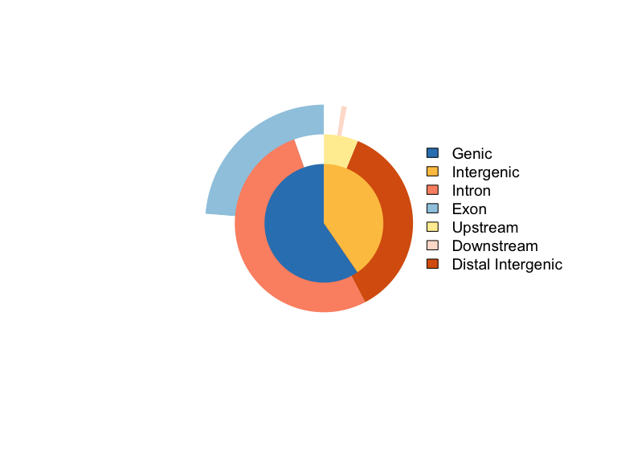
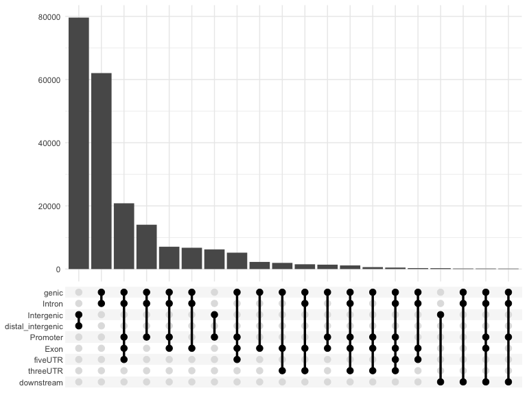
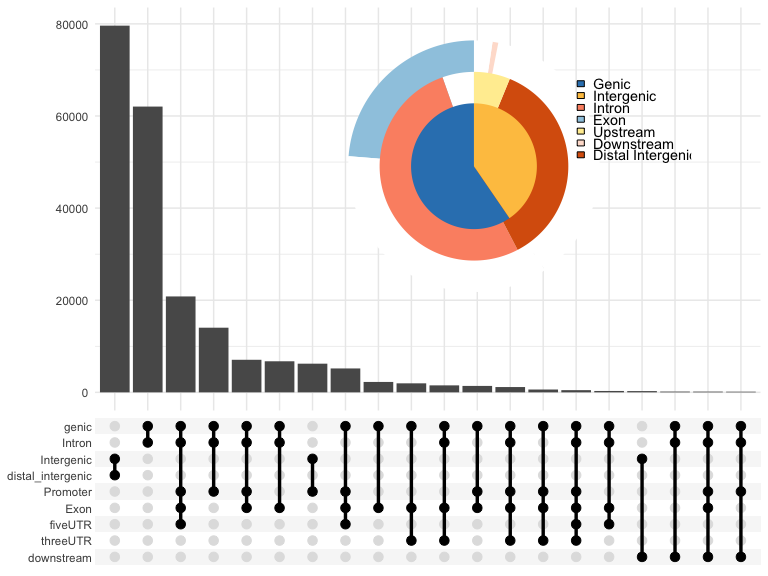
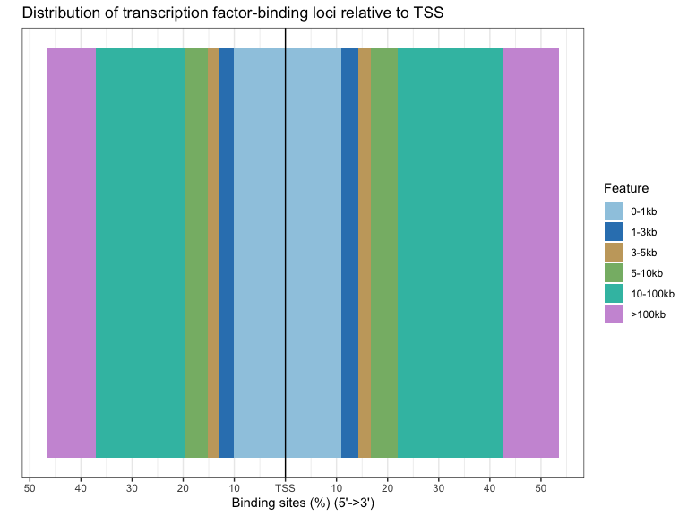
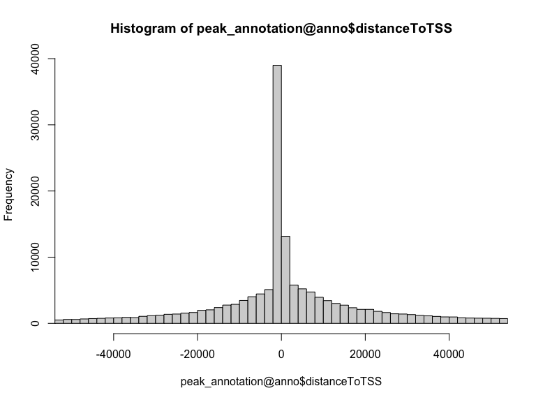
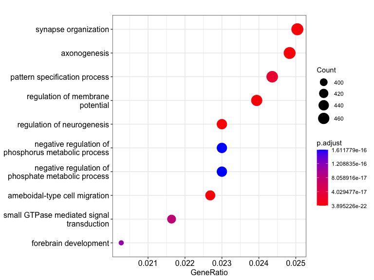
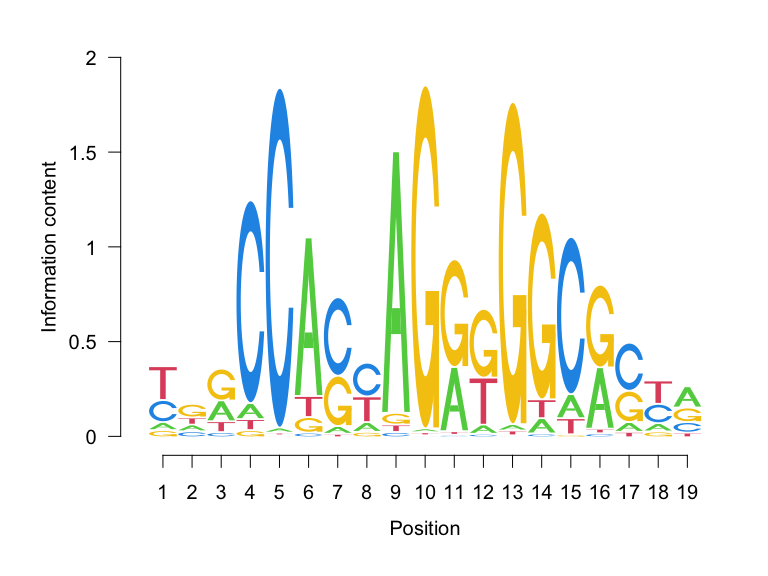
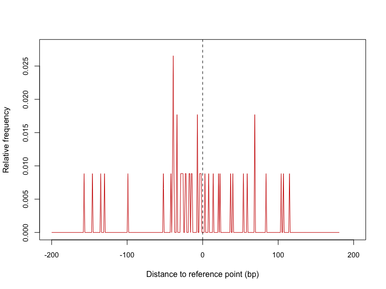

# 1. Peak file import

The second part of our practical will focus on exploring regions of enriched 
signal, also called peaks. Our peaks are stored in the `narrowPeak` format.
We will explore where they are located in the genome,
which genes they are associated with, and finally some basic motif analysis.
Lets first load the peaks and explore the peak file.


```r
library(rtracklayer)

peaks <- import("data/SRR3536937_1.trim.PE2SE.nodup.tn5_SRR3536938_1.trim.PE2SE.nodup.tn5.pf.narrowPeak.gz")
head(as.data.frame(peaks))
```

```
##         seqnames     start       end width strand   name score signalValue
## 1          chr11   3192743   3193877  1135      * Peak_1  9668    12.43024
## 2 chrUn_JH584304     58765     60182  1418      * Peak_2  8424    15.25339
## 3          chr18  40308007  40308473   467      * Peak_3  7910    32.45094
## 4          chr11   3192743   3193877  1135      * Peak_4  6637     9.80726
## 5          chr11 109011575 109012192   618      * Peak_5  3921    21.51932
## 6          chr15  75086651  75087093   443      * Peak_6  3793    33.65829
##     pValue   qValue peak
## 1 966.8886 958.4532  678
## 2 842.4288 834.7493  884
## 3 791.0176 783.7640  241
## 4 663.7982 657.0013  361
## 5 392.1180 385.6216  287
## 6 379.3041 372.8315  161
```

# 2. Peak genomic annotation and distribution

After loading and exploring the peak file, we can now assess where they are 
located in the genome. We will see which genomic features the peaks overlap with 
and how far they are located to the closest promoter.


```r
library(ChIPseeker)
library(org.Mm.eg.db)
library(TxDb.Mmusculus.UCSC.mm10.knownGene)

peak_annotation <- annotatePeak(peaks, TxDb = TxDb.Mmusculus.UCSC.mm10.knownGene,
    annoDb = "org.Mm.eg.db")
```

```
## >> preparing features information...		 2022-04-27 10:06:14 
## >> identifying nearest features...		 2022-04-27 10:06:14 
## >> calculating distance from peak to TSS...	 2022-04-27 10:06:16 
## >> assigning genomic annotation...		 2022-04-27 10:06:16 
## >> adding gene annotation...			 2022-04-27 10:06:26 
## >> assigning chromosome lengths			 2022-04-27 10:06:26 
## >> done...					 2022-04-27 10:06:26
```

```r
plotAnnoBar(peak_annotation)
```

<!-- -->

```r
vennpie(peak_annotation)
```

<!-- -->

```r
upsetplot(peak_annotation)
```

<!-- -->

```r
upsetplot(peak_annotation, vennpie = T)
```

<!-- -->

```r
plotDistToTSS(peak_annotation)
```

<!-- -->

```r
hist(peak_annotation@anno$distanceToTSS, breaks = 2000, xlim = c(-50000, 50000))
```

<!-- -->

# 3. Gene Ontology (GO) Enrichment analysis

Once we annotated the peaks, and associated them with genes, we can look if there
are any particular gene family, processes or pathways enriched in our gene set.


```r
library(clusterProfiler)

assignedGenes <- peak_annotation@anno$ENSEMBL
enrich <- enrichGO(assignedGenes, OrgDb = org.Mm.eg.db, keyType = "ENSEMBL", ont = "ALL")

dotplot(enrich)
```

<!-- -->

# 4. Motif analysis - getting motif PWMs

Next, we will explore how to find instances of specific known motifs in a set of 
genomic regions. In our case, it will be in the top 1000 scoring peaks we used 
throughout the course. One of the most comprehensive database of manually curated
TFBS matrices is [JASPAR](jaspar.genereg.net). On the JASPAR webpage, we can 
find the entry for a TFBS of interest (in our case CTCF), and retrieve it from
the `JASPAR2020` Bioconductor packge using the `TFBSTools` interface.


```r
library(TFBSTools)
library(JASPAR2020)

ctcf_pfm <- getMatrixByID(JASPAR2020, ID = "MA0139.1")
ctcf_pwm <- toPWM(ctcf_pfm)

seqLogo(toICM(ctcf_pfm))
```

<!-- -->

# 5. Motif analysis - finding motif instances in peaks

To find motif instances within peaks, we need to first retrieve the sequence of 
the peaks, and then scan the sequence with the motif PWM.


```r
library(BSgenome.Mmusculus.UCSC.mm10)
```

```
## Loading required package: BSgenome
```

```
## Loading required package: Biostrings
```

```
## Loading required package: XVector
```

```
## 
## Attaching package: 'Biostrings'
```

```
## The following object is masked from 'package:base':
## 
##     strsplit
```

```r
motif_occurence <- searchSeq(ctcf_pwm, getSeq(BSgenome.Mmusculus.UCSC.mm10, peaks[1:1000]),
    min.score = "90%")

motif_occurence_df <- writeGFF3(motif_occurence)
head(motif_occurence_df)
```

```
##      seqname source feature start end    score strand frame
## 1          1   TFBS    TFBS   347 365 15.13076      +     .
## 4          4   TFBS    TFBS   347 365 15.13076      +     .
## 31        31   TFBS    TFBS   591 609 18.14041      +     .
## 51.1      51   TFBS    TFBS   281 299 20.31346      +     .
## 51.2      51   TFBS    TFBS   881 899 20.52659      -     .
## 57        57   TFBS    TFBS   349 367 16.10411      -     .
##                                                               attributes
## 1    TF=CTCF;class=C2H2 zinc finger factors;sequence=TCTCCACCAGGGGGAGAAG
## 4    TF=CTCF;class=C2H2 zinc finger factors;sequence=TCTCCACCAGGGGGAGAAG
## 31   TF=CTCF;class=C2H2 zinc finger factors;sequence=TGGCCAGCAGGTGTCAACA
## 51.1 TF=CTCF;class=C2H2 zinc finger factors;sequence=GGGCCACCAGAGGGCGCGA
## 51.2 TF=CTCF;class=C2H2 zinc finger factors;sequence=TGGCCACCAGAAGGCACTC
## 57   TF=CTCF;class=C2H2 zinc finger factors;sequence=TGACCACTCGAGGGCACCC
```

# 6. Motif analysis - getting the peaks with motifs

We can now associate motif instances with their respective peaks.


```r
top_peaks_with_motifs <- unique(as.numeric(motif_occurence_df$seqname))
getSeq(BSgenome.Mmusculus.UCSC.mm10, peaks[top_peaks_with_motifs[1]])[[1]][347:365]
```

```
## 19-letter DNAString object
## seq: TCTCCACCAGGGGGAGAAG
```

# 7. Motif analysis - analysisng motif position

Finally, we can estimate and visualise motif position within our peaks using
the `seqPattern` Bioconductor package.


```r
library(magrittr)

top_peaks_with_motifsGR <- peaks[top_peaks_with_motifs]
peak_centered <- shift(top_peaks_with_motifsGR, top_peaks_with_motifsGR$peak) %>%
    resize(width = 1, fix = "start")
peak_centered_200bpFlank <- peak_centered + 200
peak_centered_200bpFlank_seq <- getSeq(BSgenome.Mmusculus.UCSC.mm10, peak_centered_200bpFlank)

library(seqPattern)

plotMotifDensityMap(regionsSeq = peak_centered_200bpFlank_seq, motifPWM = Matrix(ctcf_pwm),
    minScore = "90%", flankUp = 200, flankDown = 200)
```

```
## 
## Getting motif occurrence matrix...
```

```
## 
## Calculating density...
```

```
## ->motif
```

```
## 
## Plotting...
```

```
## ->motif
```

```r
plotMotifOccurrenceAverage(regionsSeq = peak_centered_200bpFlank_seq, motifPWM = Matrix(ctcf_pwm),
    minScore = "90%", flankUp = 200, flankDown = 200, color = c("red3"), cex.axis = 0.9)
```

```
## 
## Getting motif occurrence matrix...
```

```
## 
## Plotting average signal...
```

<!-- -->


