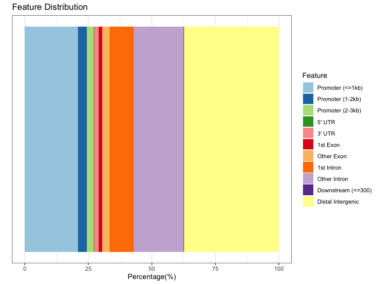
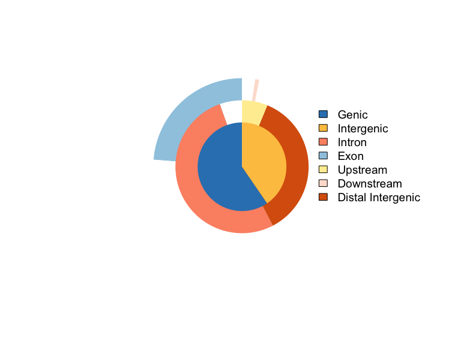
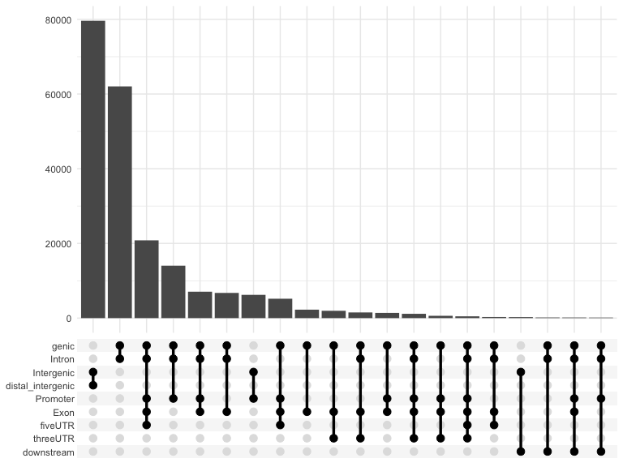
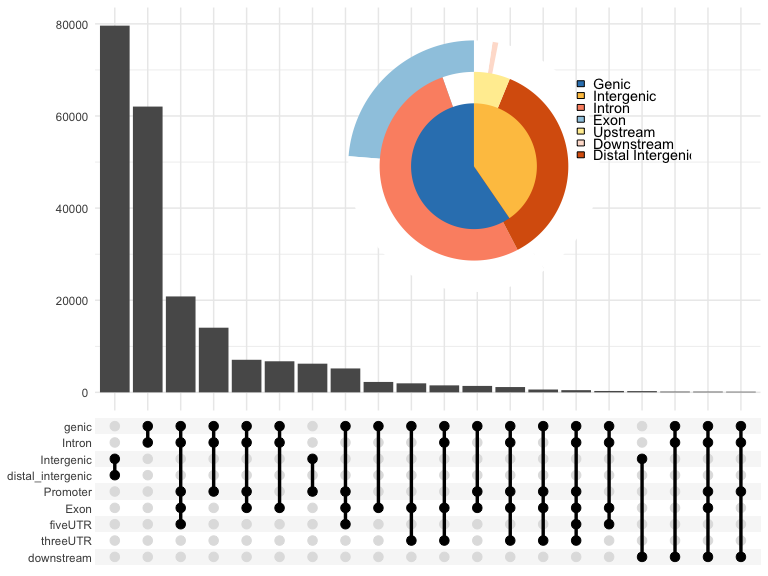
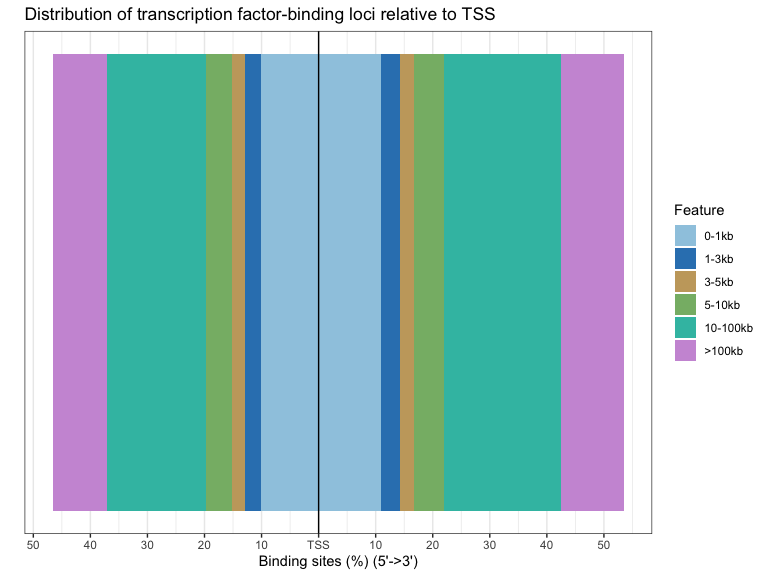
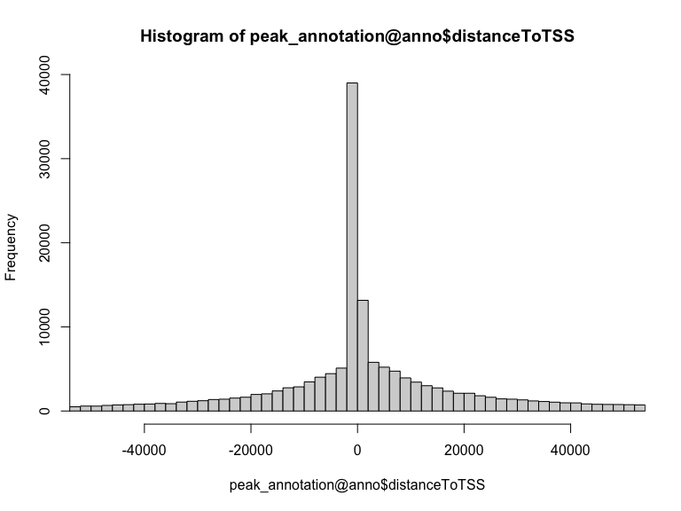

```r
library(rtracklayer)

peaks <- import("data/SRR3536937_1.trim.PE2SE.nodup.tn5_SRR3536938_1.trim.PE2SE.nodup.tn5.pf.narrowPeak.gz")
head(as.data.frame(peaks))
```

```
##         seqnames     start       end width strand   name score signalValue
## 1          chr11   3192743   3193877  1135      * Peak_1  9668    12.43024
## 2 chrUn_JH584304     58765     60182  1418      * Peak_2  8424    15.25339
## 3          chr18  40308007  40308473   467      * Peak_3  7910    32.45094
## 4          chr11   3192743   3193877  1135      * Peak_4  6637     9.80726
## 5          chr11 109011575 109012192   618      * Peak_5  3921    21.51932
## 6          chr15  75086651  75087093   443      * Peak_6  3793    33.65829
##     pValue   qValue peak
## 1 966.8886 958.4532  678
## 2 842.4288 834.7493  884
## 3 791.0176 783.7640  241
## 4 663.7982 657.0013  361
## 5 392.1180 385.6216  287
## 6 379.3041 372.8315  161
```

# header1


```r
library(ChIPseeker)
library(org.Mm.eg.db)
library(TxDb.Mmusculus.UCSC.mm10.knownGene)

peak_annotation <- annotatePeak(peaks, TxDb = TxDb.Mmusculus.UCSC.mm10.knownGene,
    annoDb = "org.Mm.eg.db")
```

```
## >> preparing features information...		 2022-04-26 10:41:54 
## >> identifying nearest features...		 2022-04-26 10:41:55 
## >> calculating distance from peak to TSS...	 2022-04-26 10:41:58 
## >> assigning genomic annotation...		 2022-04-26 10:41:58 
## >> adding gene annotation...			 2022-04-26 10:42:16 
## >> assigning chromosome lengths			 2022-04-26 10:42:16 
## >> done...					 2022-04-26 10:42:16
```

## plot1


```r
plotAnnoBar(peak_annotation)
```

<!-- -->

```r
vennpie(peak_annotation)
```

<!-- -->

```r
upsetplot(peak_annotation)
```

<!-- -->

```r
upsetplot(peak_annotation, vennpie = T)
```

<!-- -->

```r
plotDistToTSS(peak_annotation)
```

<!-- -->

```r
hist(peak_annotation@anno$distanceToTSS, breaks = 2000, xlim = c(-50000, 50000))
```

<!-- -->


# header2


```r
# library(clusterProfiler)

# assignedGenes <- peak_annotation
```
